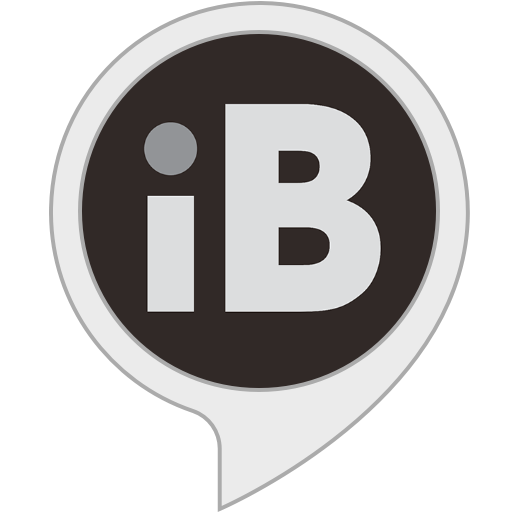

{ width=350 align=center }

# iBroadcast Music Provider { width=70 align=right }

Music Assistant has support for [iBroadcast](https://www.ibroadcast.com/home/)! Contributed and maintained by [Rob Sonke](https://github.com/robsonke)

!!! note
    - A paid subscription is required to add this Music Provider

## Features
- Support for Artists, Albums, Tracks and Playlists
- Searching the Apple Music catalogue
- Radio mode: Starting a dynamic playlist based on an Artist, Album, Track or Playlist

## Configuration
Authentication with Apple Music happens through a Music User Token. Unfortunately, Apple does not officially support 'Login with Apple' for Apple Music, so you will need to obtain your own Music User Token. Instructions were written for Chrome:

1. Navigate to [https://music.apple.com/](https://music.apple.com/)
2. Go to View > Developer > Developer Tools. A new side window will open.
3. Click the 'Application' tab. You might need to expand your window or click the `>>` button
  
Note the "Expires / Max-Age" column. Your token will expire on that date and Apple Music within Music Assistant will stop working. You will have to repeat the above process to obtain a fresh token. We will try to find an unofficial way to implement 'Login with  Apple' to make it easier to authenticate with Apple Music, but until then, this is the way to authenticate.

## Known Issues / Notes
- Due to Apple's proprietary encryption (Fairplay), Lossless and Dolby Atmos versions of songs are not supported

## Not yet supported
- Library interaction, such as adding and removing items to your Apple Music library from within Music Assistant.

{ width=350 align=center }
